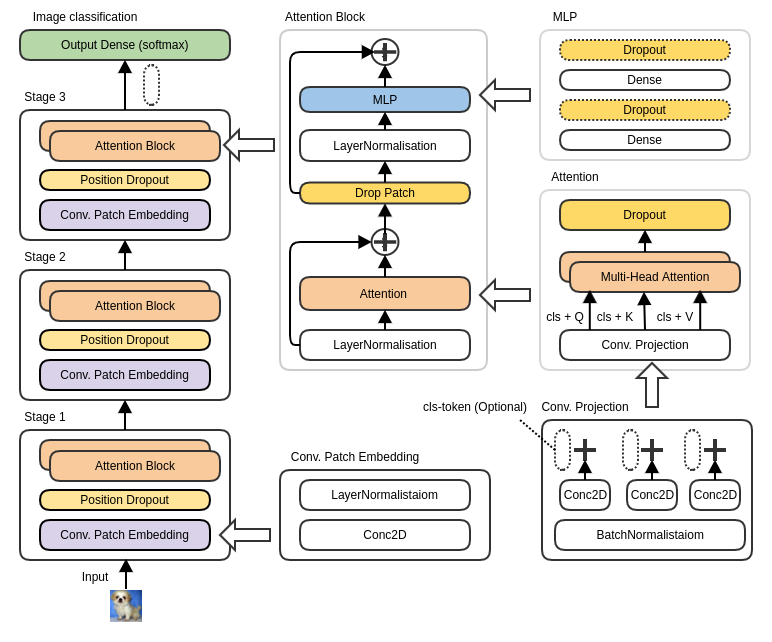

# CvT Tensorflow Implementation 
We implemented the Convolutions to Vision Transformers (CvT) into Tensorflow Version > 2.5.   
Base on GitHub code: [https://github.com/microsoft/CvT]   
Paper: [CvT: Introducing Convolutions to Vision Transformers](https://arxiv.org/abs/2103.15808)

### Our Implementation Schema 


### Implementation testing 
Pretrained on ILSVRC2012 [ImageNet-1k](https://www.google.com)  
Containes 1.3 million training images and 1000 objects categories.     

Trained on [CIFAR100](https://www.cs.toronto.edu/~kriz/cifar.html)  
Data set: 60000 images and 100 object categories
Training set: Contains 50000 images (500 objects per a category)   
Validation set: Contains 10000 images (100 objects per a category) 

### Results 
tbd

### Usage 

#### Installation

Before installing the dependencies you should consider 
to use a virtual environment. It can be created by: 

````shell
# activate the environment by running the generated activate
# script in <folder name> for your os. E.g. for windows activate.bat
python3 -m venv <folder name>
````

The necessary packages are listed in requirements.txt.
They can be installed using:

```shell
pip install -r requirements.txt
```

For the installation of the optional CUDA drivers please refer to the [tensorflow](https://www.tensorflow.org/install/gpu) documentation.

#### Configuration 

The Model can be configured with the hyper-parameters in config/config.py.

#### training


