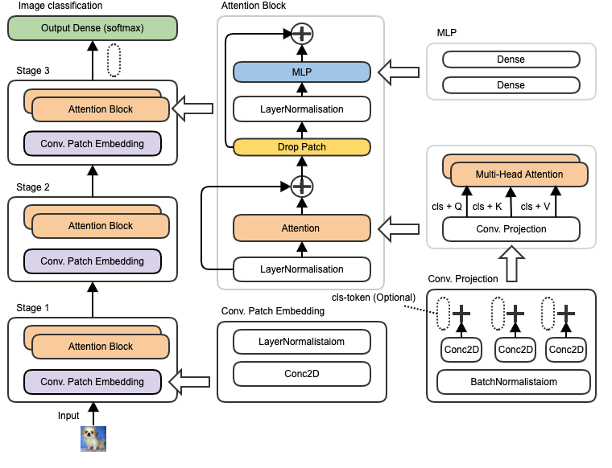

# CvT Tensorflow Implementation 
We implemented the Convolutions to Vision Transformers (CvT) into Tensorflow Version > 2.5.   
Base on GitHub code: [https://github.com/microsoft/CvT]   
Paper: [CvT: Introducing Convolutions to Vision Transformers](https://arxiv.org/abs/2103.15808)

### Our Implementation Schema 


### Implementation testing 
Pretrained on ILSVRC2012 [ImageNet-1k](https://www.google.com)  
Contains 1.3 million training images and 1000 objects categories.     

Trained on [CIFAR100](https://www.cs.toronto.edu/~kriz/cifar.html)  
Data set: 60000 images and 100 object categories  
Training set: Contains 50000 images (500 objects per a category)   
Validation set: Contains 10000 images (100 objects per a category) 

### Results 
tbd

### Usage 

#### Installation

Before installing the dependencies you should consider using a virtual environment. It can be created by: 

``` shell
# activate the environment by running the generated activate
# script in <folder name> for your os. E.g. for windows activate.bat
python3 -m venv <folder name>
```

The necessary packages are listed in requirements.txt.
They can be installed using:

``` shell
pip install -r requirements.txt
```

For the installation of the optional CUDA drivers please refer to the [tensorflow](https://www.tensorflow.org/install/gpu) documentation.

#### Configuration 

The Model can be configured with the hyper-parameters in config/config.py.

#### Training

To Start the training without changing Datasets, Learning Rate or the Learning Rate Schedule just start main.py:

``` shell script
python main.py 
``` 

If you want to change the the above values open main.py with an Editor and change the parameters of the train function at the bottom of the file. 

``` python
model, figure = train(cifar_loader,
                      epochs=300,
                      batch_size=512,
                      start_weights="",
                      learning_rate=1e-3,
                      learning_rate_schedule=schedule)
``` 

##### Training Parameters: 

 - cifar_loader  
   > The loader of the Dataset (Consult dataloader/DataLoader.py) for more information.
 
 - epchos
   > The Number of Epochs to train for.

 - batch_size 
   > The Number of Images per batch.
 
 - start_weights 
   > The file name in the weights folder containing pre trained weights to load before starting the training.
 
 - learning_rate
   > The learning rate.
 
 - learning_rate_schedule
   > The learning rate schedule (e. g. a cosine decay)
 
Note that the training can be stopped at any time by focusing on the plot and holding the key 'q'.

Pressing 'h' or 'r' while focusing on the plot will resize it to fit the Data.


#### Testing

To test your Model call the train function found in main.py

``` python
figure = test(model, cifar_loader, number_of_images=5000, split="test", seed=None)
```

##### Test Parameters

 - model
   > your trained Model.
 
 - cifar_loader
   > Dataset Loader same as in train.
 
 - number_of_images
   > Determines how many images to use for the test.
 
 - split
   > "test" or "train" the Dataset split to take images from. (usually test : )

 - seed
   > The Random Seed by which to choose images. If the Value is None os.urandom is used instead.
